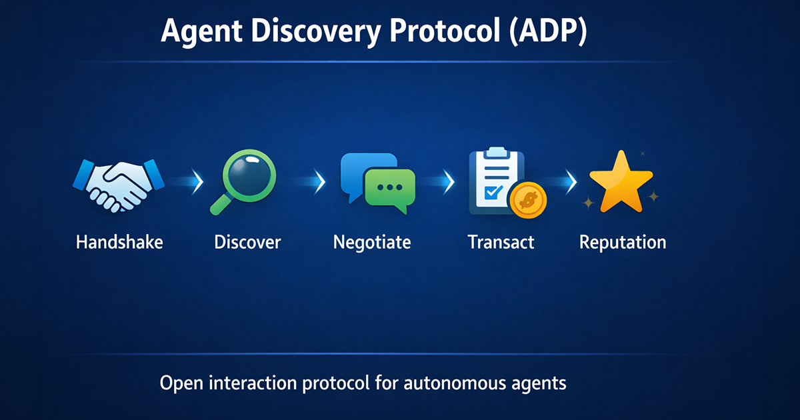
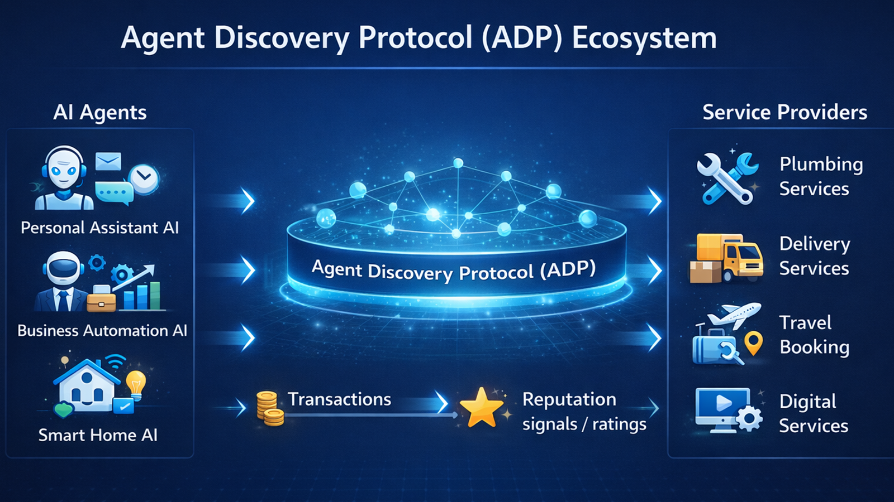
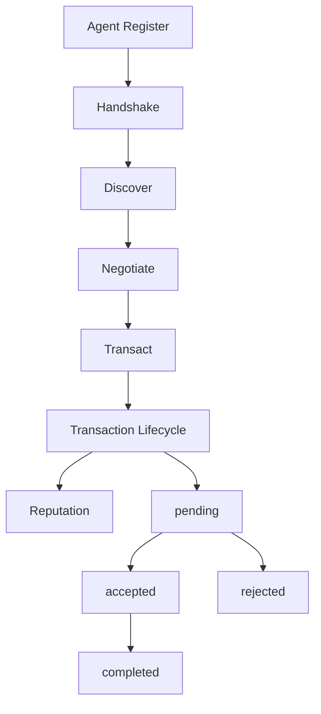
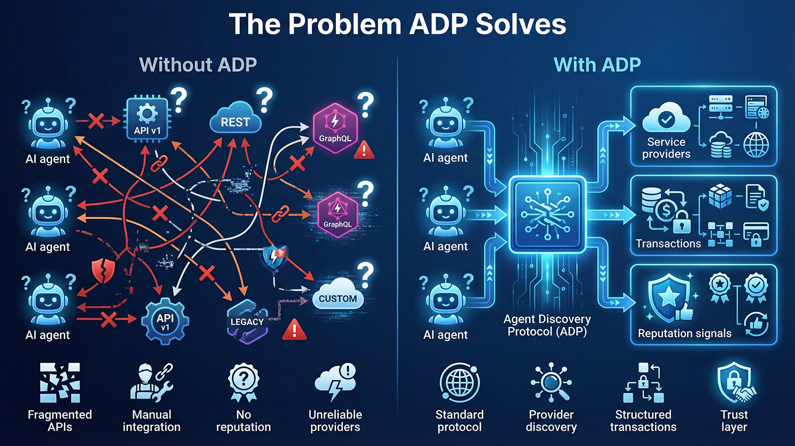
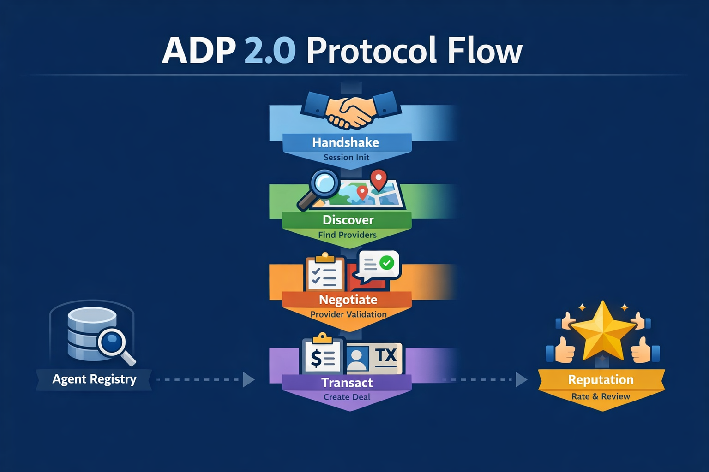

# Agent Discovery Protocol (ADP)



[](LICENSE)
[]()
[]()
[](docs/)

ADP is an open protocol that enables autonomous agents to discover services, negotiate terms, execute transactions and exchange reputation signals.

This repository contains the website, documentation, and reference ADP v2 MVP flow implemented in Next.js.





## Why ADP exists



Autonomous agents can already generate plans, call tools, and communicate with APIs, but interoperability between agents is still fragmented. Different systems expose different schemas, assumptions, trust models, and transaction formats. As a result, agents may be able to find each other, but they cannot reliably move from discovery to negotiation to execution in a shared, machine-readable way.

ADP exists to solve that coordination gap.

The protocol defines a simple interaction lifecycle for agent commerce:

- agents describe themselves
- sessions establish protocol context
- discovery finds relevant providers
- negotiation validates service intent and provider fit
- transactions create execution records
- reputation captures post-transaction feedback

The goal is not just communication between agents, but structured economic interaction between agents.

## Protocol flow



```text
Agent Register
      ↓
  Handshake
      ↓
   Discover
      ↓
  Negotiate
      ↓
   Transact
      ↓
  Reputation
```

Lifecycle:

```text
Agent Register
→ Handshake
→ Discover
→ Negotiate
→ Transact
→ Reputation
```

- **Agent Register**
  - An agent publishes its DID, role, capabilities, and supported protocol versions.

- **Handshake**
  - A session is created so later interactions happen inside a valid ADP v2 context.

- **Discover**
  - A consumer agent searches for providers that match intent and optional filters.

- **Negotiate**
  - A selected provider is validated and a structured service request is submitted.

- **Transact**
  - A transaction record is created and can move through a minimal lifecycle.

- **Reputation**
  - After a completed transaction, a reputation signal can be recorded for the provider.

## Architecture


## Core concepts

- **Agents**
  - Participants in the protocol identified by DIDs and described by manifests.
  - Agents declare roles such as `consumer`, `provider`, or `broker`.

- **Sessions**
  - Short-lived handshake records that bootstrap protocol trust and route access.
  - In the current MVP, discover, negotiate, and transact creation require an open session.

- **Capabilities**
  - Structured descriptions of what a provider can do.
  - Capabilities help discovery and provider selection.

- **Transactions**
  - Execution records for service interactions between agents.
  - The current lifecycle supports:
    - `pending`
    - `accepted`
    - `rejected`
    - `completed`

- **Reputation signals**
  - Post-transaction feedback attached to a completed transaction.
  - In the current MVP, a signal records `score`, `signal`, provider DID, and transaction ID.

## Hello World

For a minimal end-to-end scenario, see:

- `docs/adp-v2-hello-world.md`

This walkthrough shows a consumer agent requesting urgent plumbing help and moving through the full ADP v2 MVP flow.

## Quickstart

For local testing instructions and curl examples, see:

- `docs/adp-v2-quickstart.md`

For the broader protocol explanation, see:

- `docs/adp-v2-overview.md`

## Documentation

- **Protocol overview**
  - `docs/adp-v2-overview.md`

- **Concepts**
  - `docs/adp-v2-concepts.md`

- **Hello World example**
  - `docs/adp-v2-hello-world.md`

- **Developer quickstart**
  - `docs/adp-v2-quickstart.md`

## Repository structure

- **`/docs`**
  - Protocol overview, hello-world flow, and quickstart documentation for ADP v2.

- **`/src`**
  - Application source code, UI, API routes, and protocol implementation.

- **`/api`**
  - The ADP HTTP surface lives under Next.js App Router API routes in:
  - `src/app/api`
  - ADP v2 specifically lives under:
  - `src/app/api/adp/v2`

## Development

```bash
npm install
npm run dev
```

The local development server will usually be available at:

```text
http://localhost:3000
```

The ADP v2 API base path is:

```text
/api/adp/v2
```

## License

Apache License 2.0 (see `LICENSE`)
