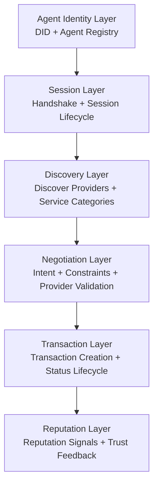

# ADP v2 Architecture

## Overview

ADP v2 is structured as a layered protocol for agent interaction.

Each layer has a focused responsibility in the protocol flow, from agent identity and session bootstrapping to service discovery, negotiation, transaction handling, and reputation feedback. In the current MVP, these layers work together to provide a clean end-to-end interaction model for autonomous agents.

## Core Layers

### Agent Identity Layer

The agent identity layer defines who participates in the protocol.

It is centered on:

- DID-based identity
- agent registry records

Agents register manifests that describe their DID, role, capabilities, categories, and supported protocol versions. This gives later layers a shared identity source for lookup and validation.

### Session Layer

The session layer establishes protocol context.

It is centered on:

- handshake
- session lifecycle

A handshake creates a session that confirms ADP v2 participation and enables later protocol steps. In the current MVP, discover, negotiate, and transact creation depend on an open session.

### Discovery Layer

The discovery layer helps a consumer find matching providers.

It is centered on:

- discovering providers
- filtering by service categories

A discover request uses session context plus service intent and optional filters. The MVP matches against registered provider manifests.

### Negotiation Layer

The negotiation layer validates a selected provider and captures the request intent.

It is centered on:

- intent
- constraints
- provider validation

In the current MVP, negotiation checks that the provider exists, has the correct role, supports ADP v2, and matches the requested service category.

### Transaction Layer

The transaction layer creates and manages execution records.

It is centered on:

- transaction creation
- status lifecycle
- `pending`, `accepted`, `completed`, `rejected`

A transaction is created after discovery and negotiation. The MVP includes a small but explicit lifecycle for transaction state updates.

### Reputation Layer

The reputation layer records post-transaction trust feedback.

It is centered on:

- reputation signals
- trust feedback

A reputation signal can be recorded after a completed transaction. This creates a minimal trust mechanism without yet adding aggregation or ranking.

## Architecture Diagram




Protocol sequence:

```text
Agent
  ↓
Handshake
  ↓
Discover
  ↓
Negotiate
  ↓
Transact
  ↓
Reputation
```
