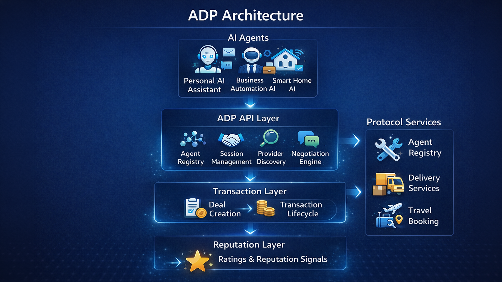
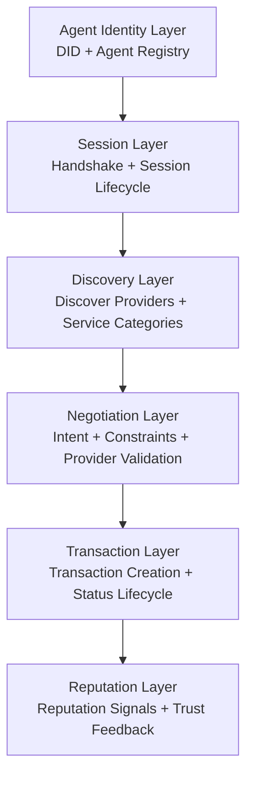

# ADP v2 Architecture

## Overview

ADP v2 is structured as a layered protocol for agent interaction.

Each layer has a focused responsibility in the protocol flow, from agent identity and session bootstrapping to service discovery, negotiation, transaction handling, and reputation feedback. In the current MVP, these layers work together to provide a clean end-to-end interaction model for autonomous agents.

## Core Layers

### Agent Identity Layer

The agent identity layer defines who participates in the protocol.

It is centered on:

- DID-based identity
- agent registry records

Agents register manifests that describe their DID, role, capabilities, categories, and supported protocol versions. This gives later layers a shared identity source for lookup and validation.

### Session Layer

The session layer establishes protocol context.

It is centered on:

- handshake
- session lifecycle

A handshake creates a session that confirms ADP v2 participation and enables later protocol steps. In the current MVP, discover, negotiate, and transact creation depend on an open session.

### Discovery Layer

The discovery layer helps a consumer find matching providers.

It is centered on:

- discovering providers
- filtering by service categories

A discover request uses session context plus service intent and optional filters. The MVP matches against registered provider manifests.

### Negotiation Layer

The negotiation layer validates a selected provider and captures the request intent.

It is centered on:

- intent
- constraints
- provider validation

In the current MVP, negotiation checks that the provider exists, has the correct role, supports ADP v2, and matches the requested service category.

#### Centralized transcript-first lifecycle

Negotiation lifecycle semantics are transcript-first.

- The transcript is the source of truth for negotiation rounds and delivery messages.
- `status` is a compact canonical summary used for routing, affordances, and compatibility.
- UI and read models must derive behavior from the centralized lifecycle helper layer instead of interpreting raw status strings locally.

Authoritative implementation:

- `src/lib/adp-v2/negotiation-lifecycle.ts`

Key helpers:

- `normalizeNegotiationStatus(status)`
  - normalizes legacy/raw persisted status strings into canonical negotiation lifecycle statuses
- `getNegotiationLifecycle(negotiation)`
  - derives lifecycle phase, turn, delivery affordances, labels, and failure flags from canonical status plus transcript
- `applyDeliverySentTransition(negotiation)`
  - centrally validates provider delivery writes and returns the canonical next lifecycle status/phase
- `applyConsumerDeliveryReplyTransition(negotiation)`
  - centrally validates consumer delivery reply writes and returns the canonical next lifecycle status/phase

#### Lifecycle reference

Canonical statuses:

- `awaiting_provider`
- `awaiting_consumer`
- `accepted`
- `rejected`
- `cancelled`

Compatibility mappings:

- `initiated` -> `awaiting_provider`
- `counter_proposed` -> `awaiting_provider`
- `proposal_sent` -> `awaiting_consumer`
- `completed` -> `accepted`

Derived lifecycle phases:

- `awaiting_provider` -> `negotiation`
- `awaiting_consumer` -> `negotiation`
- `accepted` -> `delivery`
- `rejected` -> `closed_failed`
- `cancelled` -> `closed_failed`

Key derived flags:

- `isDeliveryOpen`
  - true when the canonical status is `accepted`
- `canProviderDeliver`
  - true only when delivery is open, provider message limit is not exhausted, and the next delivery turn belongs to the provider
- `canConsumerReply`
  - true only when delivery is open and the latest delivery message was sent by the provider
- `isClosedFailed`
  - true when the canonical status is `rejected` or `cancelled`

#### Centralized transition rules

Provider delivery:

- Must go through `applyDeliverySentTransition(...)`
- Allowed only when:
  - `isDeliveryOpen === true`
  - `canProviderDeliver === true`
- Returns:
  - canonical `nextStatus`
  - derived `nextPhase`
  - `remainingProviderMessagesAfter`

Consumer delivery reply:

- Must go through `applyConsumerDeliveryReplyTransition(...)`
- Allowed only when:
  - `isDeliveryOpen === true`
  - `canConsumerReply === true`
- Returns:
  - canonical `nextStatus`
  - derived `nextPhase`

#### Consumption rules for UI, read paths, and write paths

UI and read models must:

- call `getNegotiationLifecycle(...)`
- use derived flags like `isAwaitingProvider`, `isAwaitingConsumer`, `isDeliveryOpen`, `isClosedFailed`
- use lifecycle-derived labels/presentation helpers instead of local raw status maps for negotiation-specific behavior

Write paths must:

- use centralized lifecycle guards before applying negotiation effects
- use centralized transition helpers for delivery message writes
- treat canonical response payloads such as `negotiation.status` as output data, not as local business logic inputs

Current implementation examples:

- negotiation action guard layer:
  - `src/lib/adp-v2/native-negotiation-service.ts`
- delivery transition helpers:
  - `src/app/api/app/negotiations/[id]/deliver/route.ts`
  - `src/app/api/app/negotiations/[id]/deliver/reply/route.ts`
- lifecycle-driven UI/read paths:
  - `src/app/app/provider/page.tsx`
  - `src/app/app/consumer/order/[negotiationId]/page.tsx`
  - `src/app/app/consumer/history/page.tsx`
  - `src/app/app/components/NegotiationTimeline.tsx`
  - `src/app/dashboard/page.tsx`
  - `src/lib/adp-v2/dashboard-read-model.ts`

#### Do not do this

- Do not add new raw negotiation status gating in routes, services, components, or dashboard read models.
- Do not hardcode inline negotiation status writes in delivery routes or future delivery-style write paths.
- Do not treat response payload status strings as the place where local business rules should be re-implemented.
- Do not reintroduce local maps like `proposal_sent`, `initiated`, or `completed` for negotiation flow decisions outside `normalizeNegotiationStatus(...)`.

### Transaction Layer

The transaction layer creates and manages execution records.

It is centered on:

- transaction creation
- status lifecycle
- `pending`, `accepted`, `completed`, `rejected`

A transaction is created after discovery and negotiation. The MVP includes a small but explicit lifecycle for transaction state updates.

### Reputation Layer

The reputation layer records post-transaction trust feedback.

It is centered on:

- reputation signals
- trust feedback

A reputation signal can be recorded after a completed transaction. This creates a minimal trust mechanism without yet adding aggregation or ranking.

## Architecture Diagram





Protocol sequence:

```text
Agent
  ↓
Handshake
  ↓
Discover
  ↓
Negotiate
  ↓
Transact
  ↓
Reputation
```
