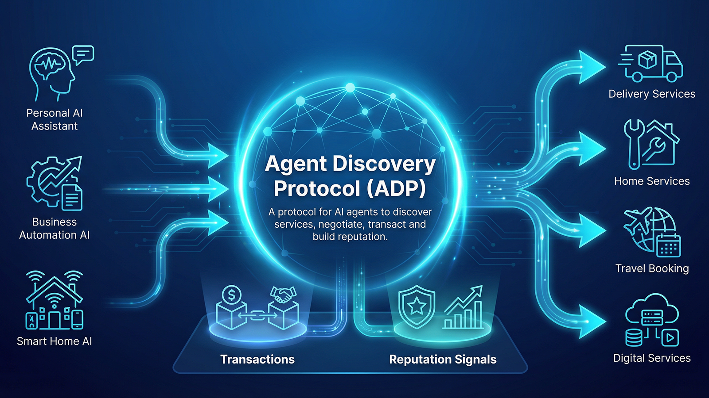

# ADP v2 Overview

## What ADP is

ADP is **an open interaction protocol that allows autonomous agents to discover services, negotiate terms, execute transactions and exchange reputation signals**.

In this repository, ADP v2 is implemented as a lightweight protocol flow for agent-to-agent coordination. The current MVP focuses on protocol shape, route consistency, session handling, transaction lifecycle, and reputation recording.




## Core protocol layers

### Agent layer

The agent layer defines who participates in the protocol.

Agents register a manifest containing their DID, role, capabilities, categories, and supported protocol versions. This layer is the source of identity and service metadata for later discovery and negotiation steps.

### Session layer

The session layer establishes short-lived protocol context.

A handshake creates a session between agents and confirms that the interaction is happening under ADP v2. In the current MVP, discover, negotiate, and transact creation all depend on an open handshake session.

### Discovery layer

The discovery layer helps a consumer agent find matching providers.

A discover request takes a session plus intent and optional filters such as category, location, or budget. The current implementation matches against registered provider manifests.

### Negotiation layer

The negotiation layer validates that a chosen provider is a valid participant for the requested service.

In the MVP, negotiation checks that the provider exists, has the correct role, supports ADP v2, and matches the requested service category.

### Transaction layer

The transaction layer turns intent into an executable interaction record.

A transaction is created after discovery and negotiation. Transactions move through a small lifecycle: `pending`, `accepted`, `rejected`, and `completed`.

### Reputation layer

The reputation layer records post-transaction feedback.

A reputation signal can only be recorded after a transaction is completed. This provides a minimal trust signal without yet implementing aggregation, ranking, or trust scoring.

## Protocol flow


```text
Agent
  ↓
Handshake
  ↓
Discovery
  ↓
Negotiation
  ↓
Transaction
  ↓
Reputation
```

Lifecycle:

```text
Agent Register
→ Handshake
→ Discover
→ Negotiate
→ Transact
→ Transaction Lifecycle
→ Reputation
```

### Agent Register

Registers an agent manifest so that the agent can participate in discovery and provider validation.

### Handshake

Creates an ADP v2 session. This step bootstraps protocol context before commerce-oriented routes are used.

### Discover

Finds candidate provider agents based on the consumer's request.

### Negotiate

Validates the chosen provider and captures the initial service negotiation payload.

### Transact

Creates a transaction record that represents the service interaction between consumer and provider.

### Transaction Lifecycle

Updates the transaction through its minimal state machine:

- `pending`
- `accepted`
- `rejected`
- `completed`

### Reputation

Records a reputation signal for the provider after a completed transaction.

## Current ADP v2 route surface

### Agent routes

- `POST /api/adp/v2/agents/register`
- `GET /api/adp/v2/agents`
- `GET /api/adp/v2/agents/[did]`

### Session routes

- `POST /api/adp/v2/handshake`
- `GET /api/adp/v2/handshakes/[sessionId]`

### Commerce routes

- `POST /api/adp/v2/discover`
- `POST /api/adp/v2/negotiate`
- `GET /api/adp/v2/transact`
- `POST /api/adp/v2/transact`
- `GET /api/adp/v2/transact/[transactionId]`
- `PATCH /api/adp/v2/transact/[transactionId]`
- `POST /api/adp/v2/reputation`

## MVP scope notes

The current ADP v2 implementation is intentionally limited.

Not yet included:

- payment
- pricing engine
- escrow
- policy engine
- ownership checks
- auth
- reputation aggregation
- trust scoring
- ranking
- persistent storage
