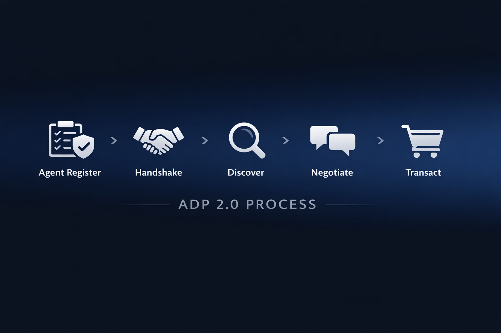

# ADP v2 Quickstart

This quickstart shows how to test the current ADP v2 implementation locally.



## API base path

```text
/api/adp/v2
```

## Key endpoints

Current implementation:

- `POST /api/adp/v2/agents/register`
- `GET /api/adp/v2/agents`
- `POST /api/adp/v2/handshake`
- `POST /api/adp/v2/discover`
- `POST /api/adp/v2/negotiate`
- `GET /api/adp/v2/transact`
- `POST /api/adp/v2/transact`
- `PATCH /api/adp/v2/transact/[transactionId]`
- `POST /api/adp/v2/reputation`

Note: agent registration is currently implemented at `POST /api/adp/v2/agents/register`.

## Run locally

Start the Next.js app:

```bash
npm run dev
```

Assume local base URL:

```text
http://localhost:3000/api/adp/v2
```

## Simple curl flow

### 1. Register provider

```bash
curl -X POST http://localhost:3000/api/adp/v2/agents/register \
  -H 'Content-Type: application/json' \
  -d '{
    "did":"did:adp:provider-001",
    "name":"QuickFix Plumbing",
    "role":"provider",
    "categories":["plumbing"],
    "capabilities":[{"key":"emergency-plumbing","description":"Urgent plumbing support"}],
    "supported_protocol_versions":["2.0"]
  }'
```

### 2. Register consumer

```bash
curl -X POST http://localhost:3000/api/adp/v2/agents/register \
  -H 'Content-Type: application/json' \
  -d '{
    "did":"did:adp:consumer-001",
    "name":"HomeOwner Agent",
    "role":"consumer",
    "capabilities":[{"key":"request-home-services","description":"Request urgent home services"}],
    "supported_protocol_versions":["2.0"]
  }'
```

### 3. Create handshake

```bash
curl -X POST http://localhost:3000/api/adp/v2/handshake \
  -H 'Content-Type: application/json' \
  -d '{
    "message_type":"HELLO",
    "protocol_version":"2.0",
    "did":"did:adp:consumer-001",
    "role":"consumer",
    "supported_versions":["2.0"],
    "nonce":"hello-123",
    "timestamp":"2026-03-11T08:00:00.000Z"
  }'
```

Save the returned `session_id` and use it below.

### 4. Discover

```bash
curl -X POST http://localhost:3000/api/adp/v2/discover \
  -H 'Content-Type: application/json' \
  -d '{
    "session_id":"hs_abc123",
    "intent":"Need urgent plumbing help",
    "category":"plumbing"
  }'
```

### 5. Negotiate

```bash
curl -X POST http://localhost:3000/api/adp/v2/negotiate \
  -H 'Content-Type: application/json' \
  -d '{
    "session_id":"hs_abc123",
    "provider_did":"did:adp:provider-001",
    "service_category":"plumbing",
    "intent":"Need urgent plumbing help",
    "budget":150,
    "currency":"EUR"
  }'
```

### 6. Create transaction

```bash
curl -X POST http://localhost:3000/api/adp/v2/transact \
  -H 'Content-Type: application/json' \
  -d '{
    "session_id":"hs_abc123",
    "provider_did":"did:adp:provider-001",
    "intent":"Book urgent plumbing repair",
    "budget":150,
    "currency":"EUR"
  }'
```

Save the returned `transaction_id` and use it below.

### 7. Accept transaction

```bash
curl -X PATCH http://localhost:3000/api/adp/v2/transact/tx_123 \
  -H 'Content-Type: application/json' \
  -d '{"status":"accepted"}'
```

### 8. Complete transaction

```bash
curl -X PATCH http://localhost:3000/api/adp/v2/transact/tx_123 \
  -H 'Content-Type: application/json' \
  -d '{"status":"completed"}'
```

### 9. Record reputation

```bash
curl -X POST http://localhost:3000/api/adp/v2/reputation \
  -H 'Content-Type: application/json' \
  -d '{
    "transaction_id":"tx_123",
    "provider_did":"did:adp:provider-001",
    "score":3,
    "signal":"Service completed successfully"
  }'
```

## Useful supporting routes

- `GET /api/adp/v2/agents`
- `GET /api/adp/v2/agents/[did]`
- `GET /api/adp/v2/handshakes/[sessionId]`
- `GET /api/adp/v2/transact`
- `GET /api/adp/v2/transact/[transactionId]`

## MVP notes

The current quickstart demonstrates the implemented MVP only.

Not included:

- auth
- ownership checks
- payment
- escrow
- reputation aggregation
- persistent storage
