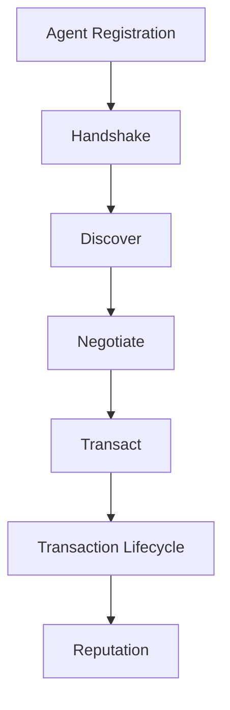

# ADP v2 Specification

## 1. Introduction

The Agent Discovery Protocol (ADP) v2 is a protocol for autonomous agent interaction.

Its goal is to enable autonomous agents to discover services, negotiate interactions, execute transactions, and exchange reputation signals in a structured, machine-readable way. ADP defines a protocol flow that moves from identity and session establishment to service matching, transaction handling, and post-transaction trust feedback.

This document describes the protocol surface and interaction model of ADP v2. It is intended as a protocol specification rather than an implementation guide.

## 2. Terminology

### Agent

An agent is a software participant in the ADP network that can send, receive, and process protocol messages.

### DID

A DID is a decentralized identifier used to represent an agent identity within the protocol.

### Provider

A provider is an agent that offers a service or capability to other agents.

### Consumer

A consumer is an agent that searches for, negotiates, and initiates service interactions with a provider.

### Session

A session is a protocol context established by a successful handshake. It represents an active interaction scope for subsequent protocol operations.

### Transaction

A transaction is a protocol record representing an intended or ongoing service interaction between agents.

### Reputation signal

A reputation signal is post-transaction feedback recorded about a provider after a completed interaction.

## 3. Protocol Flow

ADP v2 defines the following interaction sequence:

1. Agent Registration
2. Handshake
3. Discover
4. Negotiate
5. Transact
6. Transaction Lifecycle
7. Reputation

### Flow summary

- **Agent Registration**
  - Makes an agent identity and capability description available to the protocol.

- **Handshake**
  - Establishes a session that bootstraps protocol context for later interactions.

- **Discover**
  - Enables a consumer to locate matching providers.

- **Negotiate**
  - Validates a selected provider and captures structured service intent.

- **Transact**
  - Creates a transaction record for the intended interaction.

- **Transaction Lifecycle**
  - Moves a transaction through its allowed states.

- **Reputation**
  - Records trust feedback after a completed transaction.

### Mermaid flow diagram

## 4. API Surface

The current ADP v2 API surface includes the following endpoints:

- `POST /api/adp/v2/agents/register`
- `POST /api/adp/v2/handshake`
- `GET /api/adp/v2/handshakes/[sessionId]`
- `POST /api/adp/v2/discover`
- `POST /api/adp/v2/negotiate`
- `GET /api/adp/v2/transact`
- `POST /api/adp/v2/transact`
- `GET /api/adp/v2/transact/[transactionId]`
- `PATCH /api/adp/v2/transact/[transactionId]`
- `POST /api/adp/v2/reputation`

## 5. Transaction Lifecycle

ADP v2 defines a minimal transaction state model.

Supported states:

- `pending`
- `accepted`
- `rejected`
- `completed`

Allowed transitions:

- `pending → accepted`
- `pending → rejected`
- `accepted → completed`

A transaction lifecycle implementation must reject invalid state transitions outside this allowed graph.

## 6. Reputation Model

ADP v2 defines reputation as a post-transaction signal.

A reputation signal may only be recorded after a transaction has reached the `completed` state. This ensures that reputation is linked to a finished interaction rather than a proposed or incomplete one.

A reputation signal associates trust feedback with:

- a completed transaction
- a provider identity
- an evaluation payload such as score and signal text

## 7. MVP Scope

The current ADP v2 MVP does **not** include:

- authentication
- payments
- escrow
- policy engines
- distributed trust

The MVP focuses on protocol structure, interaction flow, transaction state handling, and basic reputation signaling.
